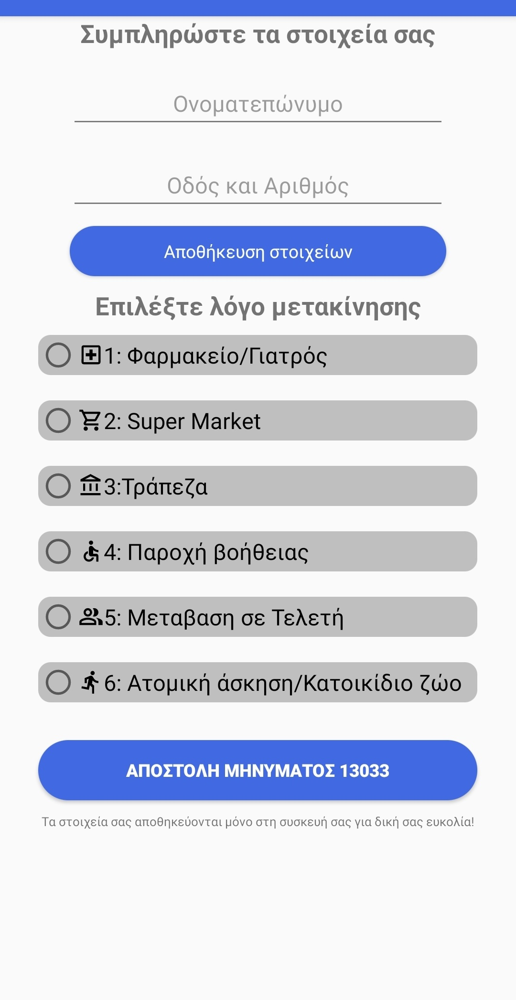
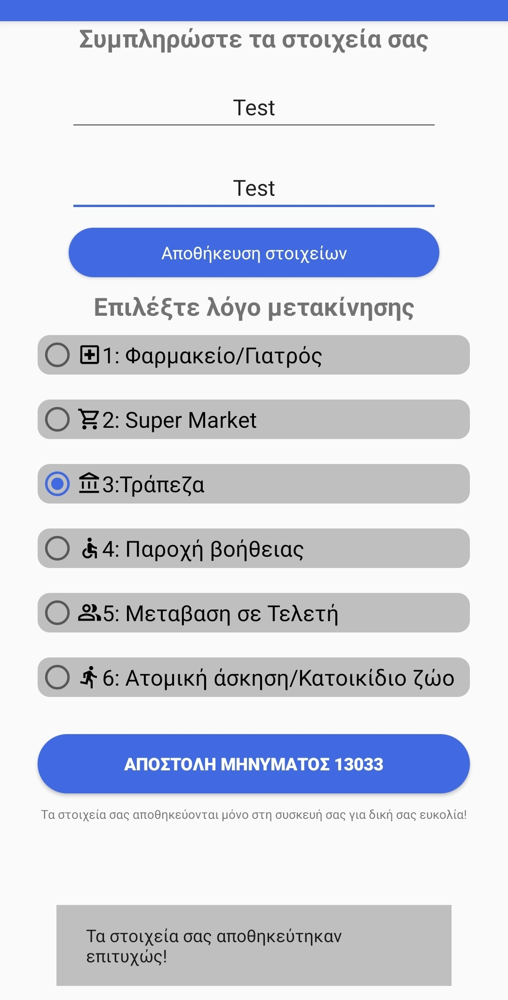

# Transport permit 13033


This application was designed during the COVID-19 outbreak to simplify the procedure to send a message to the Greek goverment to get permission to get out of the house in just 2 clicks after saving your data locally the first time if you want to.

## User Interface





## Getting Started

These instructions will get you a copy of the project up and running on your local machine for development and testing purposes.

### Prerequisites

- Install Android Studio https://developer.android.com/studio
- Download Repository 
  
```
git clone https://github.com/chkyriakos/transport-permit-13033.git
```
- Open folder from Android Studio 

## Built With

- Android Studio using Java and XML

## License

This project is licensed under the MIT License - see the [LICENSE.md](LICENSE.md) file for details


